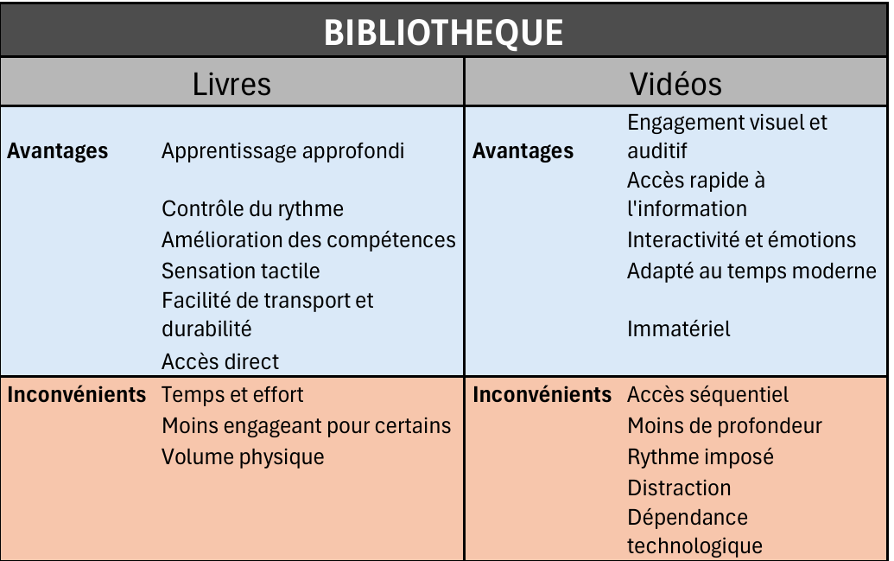
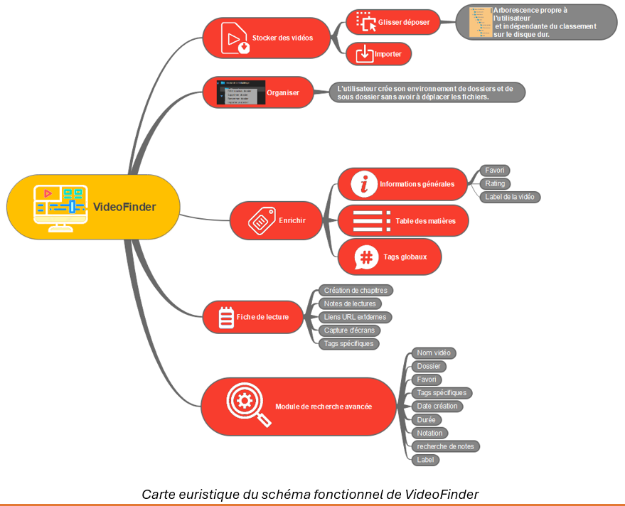
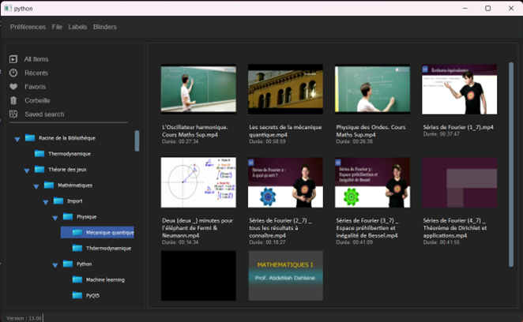
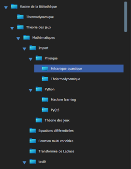
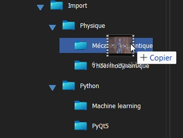
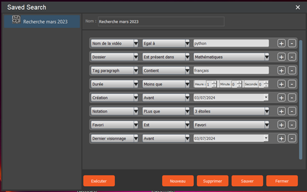

# PROJET VIDEOSCRIPT

## I - Cadre du projet

### I - 1  Initiateurs

+ **Jérôme BERTHO** : graphiste et formateur en communication numérique. Il est à l'origine du projet.
+ **Charles GRIFFE** : codeurt et analyste programmeur

### I - 2  Cadre juridique : licence GPL

La **licence GPL** (General Public Licence) est une licence libre créée par la **Free Software Fondation** (FSF) et popularisée par le **mouvement du logiciel libre** initié par **Richard Stallman**.Elle est utilisée pour distribuer des logiciels tout en garantissant aux utilisateurs certaines libertés fondemmentales.

### I - 3 Principales caractéristiques de la GPL
#### I - 3 - 1 La GPL vise à garantir

+ **Liberté d'utiliser le logiciel** : les utilisateurs peuvent utiliser le logiciel pour n'emporte quel usage.
+ **Liberté d'étudier et de modifier le logiciel** : les utilisateurs peuvent accéder au code source, ce qui leur permet de comprendre comment le logiciel fonctionne et de l'adpter à leurs besoins.
+ **Liberté de redistribuer des copies** : les utilisateurs peuvent partager des copies du logiciel avec d'autres, gratuitement ou moyennant un coût de distribution.
+ **Liberté de distribuer les versions modifiées** : si un utilisateur modifie le logiciel, il peut redistribuer cette version modifiée, sous réserve de respecter les termes de la GPL.

#### I - 3 - 2 Conditions importantes

+ Toute redistribution du logiciel, modifié ou non, doit se faire sous la même licence GPL. Cela garantit que les droits accordés par la licence continuent d'être transmis.
+ Les modifications doivent être accompagnées du code sourceou une offre de le fournir.
+ Il est interdit de restreindre davantage les droits accordés par la GPL.

En résumé, la licence GPL est un outil juridique qui promeut la liberté dans le domaine des logiciels tout en protégeant les droits des utilisateurs et des développeurs.

#### I - 3 - 3 Inviter des contributeurs
Le développement initial de l'application étant terminé (consulter le fichier README.md), le travail qui va se mettre en place va permettre de développer le projet autour des axes suivants :
+ Diffuser le projet pour en augmenter l'audience
+ Assurer la stabilité de l'application
+ Améliorer la rédaction du code source

#### I - 3 - 4 Tâches à répartir

**1 . Développeurs**
+ **rédaction du code source** : Ecrire, maintenir et améliorer les fonctionnalités du projet.
+ **Correction de bugs** : Identifier et résoudre les problèmes signalés dans le code.
+ **Révision du code** : Passer en revue les contributions des autres pour assurer la qualité et la conformité au projet.

**2 . Mainteneurs**
+ **Coordination des contributions** : Examiner, intégrer et valider les pull requests et les modifications proposées.
+ **Gestion de la feuille de route** : Définir les objectifs à long terme.
+ **Publication des versions** : Préparer, tester et diffuser les versions stables du projet.

**3 . Contributeurs externes**
+ **Proposition de nouvelles fonctionnalités** : Suggérer ou soumettre des idées pour améliorer le projet.
+ **Documentation** : Rédiger ou améliiorer les guides d'utilisation, tutoriels, FAQ ou API.
+ **Traduction** : Rendre le projet accessible en d'autres langues.

**4 . Testeurs**
+ **Tests manuels** : Essayer les différentes fgonctionnalités et signaler les anomalies.
+ **Automatisation des tests** : Ecrire des scripts de tests automatisés pour vérifier la stabilité et la performance.
+ **Retours d'expérience** : Partager leur expérience utilisateur pour aider à améliorer l'ergonomie et la convivialité

**5 . Concepteurs (designers)**
+ **Interface utilisateur (UI)** : Créer des interfaces attrayantes et intuitives.
+ **Expérience utilisateur (UX)** : Améliorer la navigation et les interactions au sein du logiciel.
+ **Identité visuelle** : Contribuer à l'image de marque du projet (logos, couleurs, etc.).

**6 . Communauté et utilisateurs**
+ **Feedback** : Fournir des retours sur les fonctionnalités, la performance et les problèmes rencontrés.
+ **Promotion**: Partager le projet sur les réseaux sociaux, forums, et autres plateformes pour attirer plus d'utilisateurs et de contributeurs.
+ **Support technique** : Aider d'autres utilisateurs via des forums ou des groupes de discussion.

**7 . Sponsors ou donateurs**
+ **Financement** : Fourrnir des ressources financières pour l'hébergement, les outils ou le développement.
+ **Partenariat** : Collaborer pour augmenter la portée ou intégrer le projet dans d'autres écosystèmes.

**8 . Experts en gestion de projet**
+ **Planification** : Structurer et organiser les tâches, les deadlines et ls ressources.
+ **Communication** : Faciliter les échanges entre contributeurs et maintenir la transparence.
+ **Gestion des conflits** : Résoudre les désacoords entre membres de l'équipe.

**9 . Juristes ou experts en licences**
+ **Vérification de la conformité** : S'assurer que le projet respecte les exigences de la GPL et d'autres licences open source.
+ **Conseils légaux** : Fournir des recommandations sur l'utilisations, la redistribution ou la compatibilité avec d'autres licences.

Ensemble, ces rôles favorisent la collaboration, l'innovation et la diffusion des logiciels sous licence GPL, tout en garantissant leur qualité et leur rrespect des principes open source.

## II - Description du projet

### **II - 1 Préambule**

Avant l'avènement de l'informatique et, plus généralement, des technologies de l'information, la transmission des savoirs et des connaissances se transmettaient quasiment exclusivement par le livre, les journaux et autres imprimés.

Depuis, les supports de transmission se sont diversifiés. Le supportt vidéo est celui qui est le plus présent dans nos bibliothèques virtuelles ou physiques. Cependant la vidéo n'a pas supplanté le livre et vice versa. De fait, les deux sont indispensables.

L'originaloité de cette application est de pouvoir enrichir la vidééo d'éléments sémantiques écrits que nous appellerons **fiche de lecture** basé sur des **"Eléments Sémantiques Synchronisés (E.S.S.).

### **II - 2 Introduction**

VideoScript est une application de gestion et d'organisation des informations (mp4, dans sa première version, puis pdf, xls, txt, etc.) conçue pour aider les utilisateurs à stocker, organiser et retrouver les vidéos de manière efficace. Les E.S.S. permettent d'accéder jusqu'au contenu cognitif dansla vidéo.

Les vidéos peuvent concerner une formation, un tutoriel, un enseignement, une conférence, etc.

Au-delà d'une gestion de bibliothèque de vidéos, VideoScript permet de réaliser desfiches delecture comportant des notes, des chapitres, des liens URL externes, des captures d'écran et des tags spécifiques. Les fiches de lecture permettent à l'utilisateur d'ajouter des E.S.S. avec le time code de la vidéo au moment du visionnage ou d'une recherche ultérieure.

De ce fait, on peut rechercher une information soit en parcourant la vidéo ou en se référant à la fiche de lecture. Dansla pratique, les deux méthodes sont utilisées simultanément dans la mesure où la vidéo et les éléments de la fiche de lecture sont synchronisés.

### **II - 3 Enrichissement sémantique synchronisé.**

Comme nous l'avons précisé précédemment, la vidéo et l'écriture sont à la fois différents et complémentaires. Notre réflexion s'est porté sur l'analyse des différences en termes d'avanages et d'inconvénients.

C'est sur la base de cette analyse, que nous avons implémenté les E.S.S.

Pour bien comprendre la signification de ce concept, il suffit d'expliciter les 3 termes qui le composent :

+ **Enrichissement** : il s'agit d'avoir la possibilité d'ajouter des éléments à la vidééo permettant de dépasser ses limites propres (voir tableau ci-dessus).
+ **Sémantique** : cela indique que l'élément rapporté vient enrichir le sens complémentaire à la vidéo (ces éléments peuvent être des notes, des chapitres, des captures d'écran, des liens URL).
+ **Sunchronisés** : comme cela a été précisé dans le tableau ci-dessus, la vidéo simple ne peut être parcourue qu'en faisant défiler préalablement les images qui précèdent (ce qui peut prendre du temps et des manipulations complexes). C'est pourquoi nous avons établi une corrélation double qui permet, à partir d'un élément sémantique ajouté, d'atteindre l'image (time code) qui lui correcpond. De même, à partir d'une image donnée, on peut afficher son élément sémantique.

### **II - 4 Choix technologiques et logiciels**

Il s'agit d'un développement d'une application sur la base de Python 3.10 en utilisant le module PyQt5. Le projet a fait l'objet d'un repository distant sur la plateforrme GitHub et l'éditeur Pycharm.

## III - Schéma fonctionnel

Le schéma ci-dessus présente les cinq fonctionnalités fondemmentales de l'application, à savoir :

+ **Stocker les vidéos**
+ **Organiser**
+ **Enrichir**
+ **Fiche de lecture (enrichissement sémantique synchrronisé)**
+ **Module de recherche avancée.**

### III - 1 Stocker les vidéos
 
Une vidéothèque, par définition, est un ensemble organisé et répertorié de fichiers vidéo. Il es d'usage de classer les fichiers dans une arborescence de répertoires par l'intermédiaire del'explorateur de fichiers (Windows) et du finder (macOS).

VideoScript dispose d'un système de dossiers hiérarchisés dans une arborescence indépendant de la position physique des vidéos dans la FAT (File Allocation Table).

Il existe 3 méthodes :

    1. l'explorateur de fichier
    2. glisser déposer de fichiers
    3. extraire un morceau de l'arborescence de l'explorateur 

De ce fait, ajouter des vidéos et même les dupliquer n'alourdit pas les ressources dans la mesure où seul le chemin de la vidéo est stocké.

Lorsqu'on efface un dossier, les sous dossiers sont également supprimés et les vidéos qu'ils contiennent sont transférés dans la corbeille pour un traitement ultérieur.

#### **III - 1 - 1 Explorateur de fichiers**

Tous les dossiers de l'arborescence de VideoScript disposent d'un menu déroulant qui affiche une boite de dialogue pour atteindre une vidéo et l'ajouter au dossier sélectionné.

#### **III - 1 - 2 Glisser déposer**

Il suffit de déplacer à la souris la vidéo concernée dans le dossier choisi. 

#### **III -1 - 3 Importer un extrait de l'arborescence de l'explorateur**

Pour cela, il suffit de faire glisser la racine de l'extrtait de l'arborescence et de le déposer sur le dossier de l'arborescence de VideoScript choisi. Les dossiers correspondants sont créés à l'identique des répertoires importés et les vidéos également.

### **III - 2 Enrichissement des vidéos (mode édition)

---

Lorsqu'une vidéo est importée, seules les informations basiques sont enregistrées dans la base de données de VideoScript, à savoir :

+ **Le nom et l'extension du fichier**
+ **Son chemin complet**
+ **Sa durée**
+ **Sa date de création**
+ et quelques attributs par défaut

Le module Edition permet d'ajouter d'autres attributs qui faciliteront le classement et la recherche de la vidéo, à savoir :

+ **Note (0 à5)**
+ **Favori**
+ **Label (pastille de couleur)**
+ **La table des matières. Elle est générée automatiquement par VideoScript**
+ **Des tags globaux (implémentés dans les meta data de la vidéo)**

### **III - 3 Fiche de lecture**

Une fiche de lecture permet d'ajouter un certain nombre d'éléments tels que : chapitres, notes, liens URL, captures d'écran, tags spécifiques, etc. Ces éléments sont reliés au fichier vidéo par le time code ce qui permet de naviguer soit directement sur le player ou passer par les chapitres de la fiche de lecture.

D'autre part, elle permet d'insérer un marque page afin de retrouver l'espace de travailidentique à la précédente utilisation.

#### **III - 3 -1 Contenu de la fiche de lecture**

Une fiche de lecture est constituée de blocs composés des éléments suivants :

+ **Chapitres**
+ **Notes**
+ **Liens URL**
+ **Captures d'écran**
+ **Tags spécifiques**

L'utilisateur a le choix, pour un bloc donné, de créer tout ou partie des éléments cités.

Ces blocs sont synchonisés avec l'emplacement du bloc sur le time code.

#### **III - 3 - 2 Contenu d'un bloc**

Ils sont consitués de tout ou partie de la liste suivante :

##### **III - 3 - 2 - 1 Les chapitres**
Il s'agit du titre du bloc. c'est sur la base des chapitres créés que VideoScript construit la table des matières.

##### **III - 3 - 2 - 2 Les notes**
Un éditeur permet de rédiger des notes formatées.

##### **III - 3 - 2 - 3 Liens URL**
Ils sont créés dans l'éditeur de notes et il permet d'accéder à des ressources distantes qui viendront compléter les informations contenues dans la vidéo.

##### **III - 3 - 2 - 4 Les tags spécifiques**

A la différence des tags globaux qui sont enregistrés directement dans les méta datas du fichier vidéo, il s'agit de tags qui sont stockés dans la base de données de VideoScript. Ils caractérisent un emplacement spécifique de la vidéo.

##### **III - 3 - 2 - 5 Les captures d'écran**

Les captures d'écran sont réalisées dans le cadre de la création du bloc. Elles permettent d'illustrer la fiche de lecture et, dans le cas d'une lecture ultérieure, d'étuider des éléments particuliers de la vidéo qui supposent une étude plus approfondie (un schéma, une formule, un organigramme, etc.)

Elles permettent également de choisir l'image qui servira de vignette à la vidéo.

## **IV - Sélection rapide**

Il existe des commandes qui permettent de sélectionner les vidéos en fonction de leur dossier, leur date de dernière utilisation, etc.

Par ailleurs, VideoScript propose une corbeille qui archive les fichiers lorsqu'ils n'apparaissent plus utiles. Ces fichiers peuvent être restaurés ou définitivement effacés selon les besoins.

## **V - Module de recherche avancé**

Ce module permet de construire des requètes complexes combinées. Ces requètes peuvent être sauvegardées en vue d'une réutilisation ultérieure.

Les critères concernés par la recherche sont :

+ **Nom de la vidéo**
+ **Favorri**
+ **Dossier**
+ **Tags spécifiques**
+ **Date de création**
+ **Notation**
+ **Label**
+ **Recherche dans les notes**

