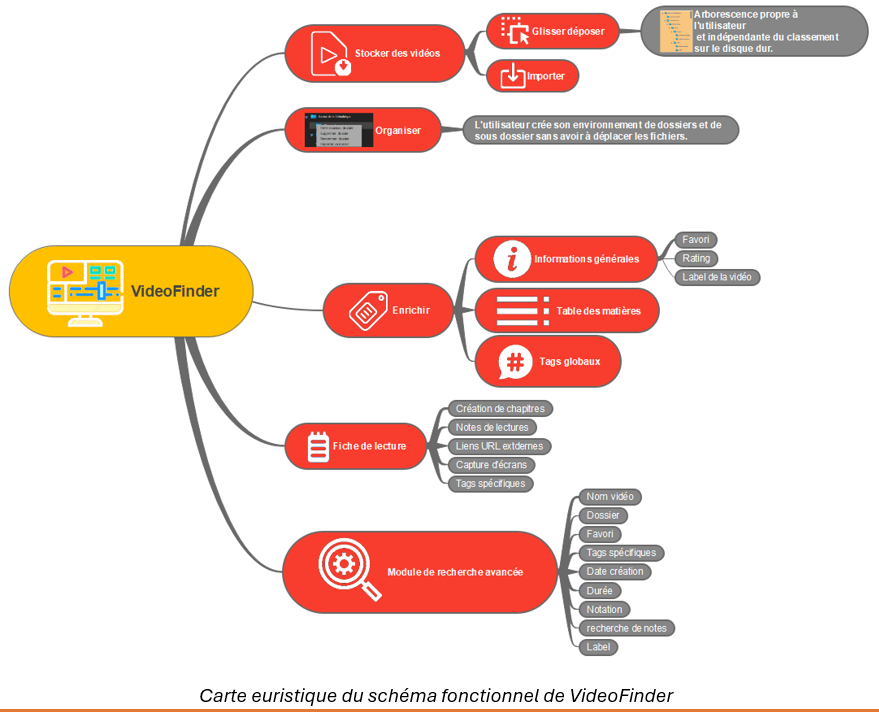

#  VIDEO FINDER - ReadMe.md

##  Introduction

**VideoFinder** est une application de gestion et d’organisation des informations (MP4 dans sa première version puis PDF, XLS, TXT, etc.) conçue pour aider les utilisateurs à stocker, organiser et retrouver les vidéos de manière efficace. Les vidéos peuvent concerner une formation, un tutoriel, une œuvre cinématographique, un enseignement, une conférence, etc.

Au-delà d’une gestion de bibliothèque de vidéos, VideoFinder permet de réaliser des fiches de lecture comportant des notes, des chapitres, des liens URL externes, des captures d’écran et des tags spécifiques. Les fiches de lectures permettent à l’utilisateur d’ajouter des éléments de synthèse synchronisés avec le time code de la vidéo au moment du visionnage ou d’une recherche ultérieure.

De ce fait, on peut rechercher une information soit en parcourant la vidéo ou en se référant à la fiche de lecture. Dans la pratique les deux méthodes sont utilisées simultanément dans le mesure où la vidéo et les éléments de la fiche de lecture sont synchronisés.  

Ecran d'accueil de VideoFinder.

##  I - Stockage des vidéos :

Une vidéothèque, par définition, est un ensemble organisé et répertorié de fichiers vidéos. Il est d’usage de classer les fichiers dans une arborescence de répertoires par l’intermédiaire de l’explorateur de fichiers (Windows) ou du finder (macOS). 

VideoFinder dispose d’un système de dossiers hiérarchique qui permettent de créer une organisation arborescente indépendante de la position physique des vidéos dans la FAT (file allocation table).

Arborescence des dossiers.
Il existe 3 méthodes : l’explorateur de fichiers, glisser déposer de fichiers et importer un extrait de l’arborescence de l’explorateur de fichiers en le greffant dans n’importe quel point de l’arborescence de VideoFinder.

De ce fait, le fait d’ajouter des vidéos et même de les dupliquer n’alourdit pas les ressources dans la mesure où seul le chemin de la vidéo est stocké.
Lorsqu’on efface un dossier, les sous dossiers sont également supprimés et les vidéos qu’ils contiennent sont transférés dans la corbeille pour un traitement ultérieur.

###  Explorateur de fichier

Tous les dossiers de l’arborescence de VideoFinder disposent d’un menu déroulant qui affiche une boite de dialogue pour atteindre une vidéo et l’ajouter au dossier sélectionné.

###  Glisser - déposer

Il suffit de déplacer à la souris la vidéo concernée et la déposer dans le dossier choisi.

Glisser déposer d'une vidéo dans un dossier.

###  Importer un extrait de l’arborescence de l’explorateur de fichiers

Pour cela, il suffit de faire glisser la racine de l’extrait de l’arborescence de l’explorateur de fichiers et de le déposer sur le dossier de l’arborescence de VideoFinder choisi. Les dossiers correspondants sont créés à l’identiques des répertoires importés et les vidéos également.

Importation d’un répertoire ainsi que ses sous répertoires

##  Enrichissement des vidéos (mode édition)

Présentation des différentes pages du mode édition

Lorsqu’une vidéo est importée, seules les informations basiques sont enregistrées dans la base de données de VideoFinder, à savoir :

+ Le nom et l’extension du fichier
+ Son chemin complet
+ Sa durée
+ Sa date de création
+ Autres attributs par défaut

Le module Edition permet d’ajouter d’autres attributs qui faciliteront le classement et la recherche de la vidéo, à savoir :

+ Note (0 à 5)
+ Favori
+ Label (pastille de couleur)
+ La table des matières (en consultation). Elle est générée automatiquement par VideoFinder
+ Des tags globaux (implémenté dans les Meta datas du fichier vidéo.
+ Supprimer les classeurs

##  Fiche de lecture

Une fiche de lecture permet d’ajouter un certain nombre d’éléments tels que : chapitres, notes, liens URL externes, captures d’écran et tags spécifiques. Ces éléments sont reliés au fichier vidéo par le time code ce qui permet de naviguer soit directement sur le player ou passer par les chapitres de la fiche de lecture.
D’autre part, elle permet d’insérer un marque page afin de retrouver l’espace de travail identique à la prochaine utilisation.

Mode étude avec le player à gauche et la fiche de lecture à droite.

##  Contenu de la fiche de lecture

Une fiche de lecture est composée de blocs constitués des éléments suivants : chapitres, notes, liens URL externes, captures d’écran et tags spécifiques. L’utilisateur a le choix, pour un bloc donné, de créer tout ou partie des éléments cités. 

Ces blocs sont chronologiquement liés à l’emplacement du bloc sur le time code.

###  Contenu d'un bloc :

Ils sont composés de tout ou partie de la liste suivante :

####  Les chapitres :
Il s’agit du titre du bloc. C’est sur la base des chapitres créés que VideoFinder construit la table des matières. 

#### Les notes :
Un éditeur permet de rédiger des notes formatées.

#### Les liens URL externes
Ils sont créés dans l’éditeur de notes et ils permettent d’accéder à des ressources distantes qui viendront compléter les informations contenues dans la vidéo.

####  Les tags spécifiques
A la différence des tags globaux qui sont enregistrés directement dans les Méta datas du fichier vidéo, il s’agit de tags qui sont stockés dans la base de données de VideoFinder. Ils caractérisent un emplacement spécifique de la vidéo.

#### Les captures d'écran :
Les captures d’écran sont réalisées dans le cadre de la création du bloc. Elles permettent d’illustrer la fiche de lecture et, dans le cas d’une lecture ultérieure, d’étudier des éléments particuliers de la vidéo qui supposent une étude plus approfondie (un schéma, un organigramme, etc.).
Elles permettent également de choisir l’image qui servira de vignette à la vidéo.

##  Sélection rapide

Il existe des commandes qui permettent de sélectionner les vidéos en fonction de leur dossier, leur date de dernière utilisation.
Par ailleurs, VideoFinder propose une corbeille qui archive les fichiers vidéo lorsqu’ils n’apparaissent plus utiles. Ces fichiers peuvent être restaurés ou totalement effacés selon le besoin.

##  Module de recherche avancée

Ce module permet de construire des requêtes complexes combinées. Ces requêtes peuvent être sauvegardées en vue d’une réutilisation ultérieure.

Les critères concernés par la recherche sont :

+ Nom de la vidéo
+ Favori
+ Dossier
+ Tag spécifique
+ Date de création
+ Durée
+ Notation
+ Label
+ Recherche dans les notes

Recherche avancée.

